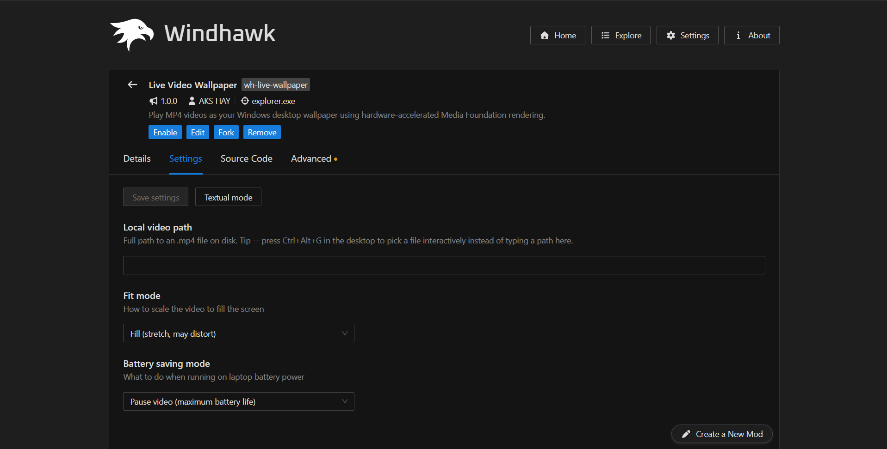
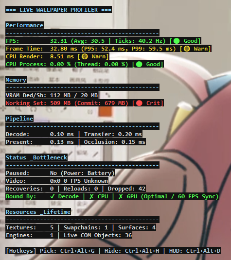
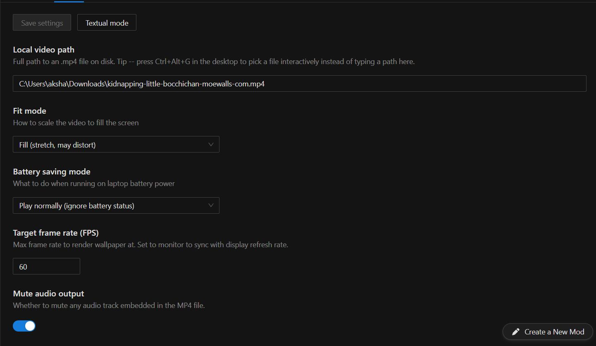
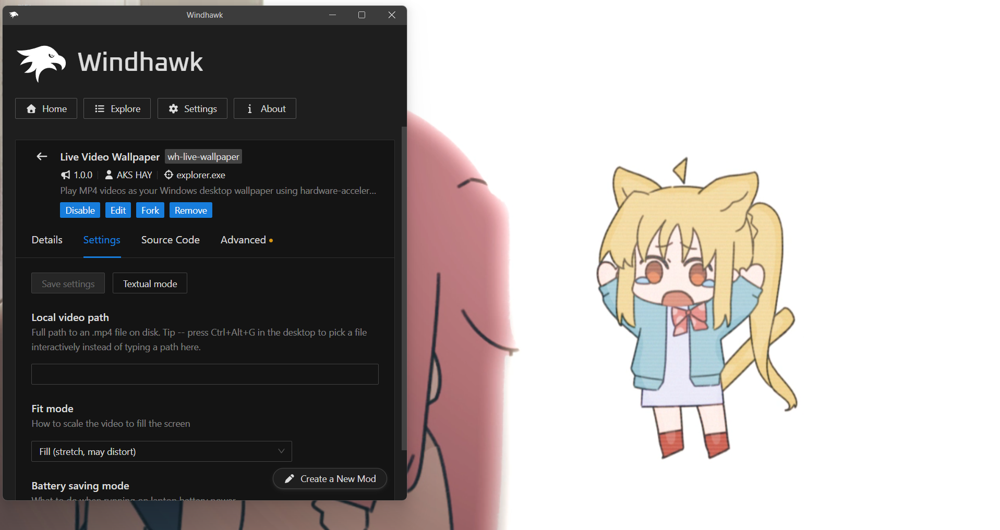

# 🎥 Live Video Wallpaper for Windhawk (`live-video-wallpaper-wh`)

> **Hardware-Accelerated MP4 Live Desktop Wallpaper for Windows 10 & 11**  
> Play local MP4 videos directly on your Windows desktop with zero-copy GPU decoding and a built-in real-time hardware performance profiler.

   

---

## 📸 Previews & Screenshots

| 🎬 **Live Video Wallpaper Playback** | 📊 **Real-Time Performance Profiler HUD** |
| :---: | :---: |
|  |  |
| *Smooth 60 FPS video rendering directly on your desktop* | *Live wall-clock FPS, VRAM usage, and microsecond pipeline breakdown (`Ctrl+Alt+D`)* |

| 📂 **Interactive File Picker (`Ctrl+Alt+G`)** | ⚡ **Smart Battery & Occlusion Saving** |
| :---: | :---: |
|  |  |
| *Instantly pick any local `.mp4` video on the fly* | *Auto-pauses when gaming or running on laptop battery* |

---

## ✨ Why Live Video Wallpaper?

Unlike traditional animated wallpaper applications that consume heavy background CPU and memory, **Live Video Wallpaper** integrates directly into `explorer.exe` via [Windhawk](https://windhawk.net/). By utilizing **Windows Media Foundation** and **Direct3D 11**, it decodes and renders video frames completely on the GPU:

* 🚀 **Zero-Copy GPU Rendering:** Video frames are decoded directly to Direct3D 11 offscreen targets and presented using flip-model swap chains (`DXGI_SWAP_EFFECT_FLIP_DISCARD`) for tear-free, crystal-clear 60 FPS playback.
* 🛡️ **Smart Occlusion Detection:** Automatically detects when full-screen applications or maximized windows cover your desktop (`P95` CPU check < 0.1 ms) and pauses rendering to free up 100% of GPU resources for gaming and productivity.
* 🔋 **Battery-Aware Power Saving:** Automatically adapts when running on laptop battery power—choose whether to pause completely, throttle to 15 FPS, or continue normal playback.
* ⚡ **Instant First-Frame Presentation:** Decodes and presents the initial video frame immediately upon loading so your desktop never gets stuck on a black screen.
* 🎨 **Flexible Scaling:** Support for both **Fill** (stretch/zoom to cover screen) and **Fit** (letterbox with cinema-style black bars).
* 🛠️ **Auto-Recovery:** Built-in resilience against D3D device-loss events (`DXGI_ERROR_DEVICE_REMOVED`) and Media Foundation decode stalls.

---

## 🚀 Quick Start & First-Time Setup

### 1️⃣ Prerequisites
1. Download and install **[Windhawk](https://windhawk.net/)** (if you haven't already).
2. Ensure you are running **Windows 10** or **Windows 11**.

### 2️⃣ Installing the Mod
1. Open the **Windhawk** application.
2. Search for **`Live Video Wallpaper`** (or install via local source/custom mod entry using this repository).
3. Click **Install / Compile** and enable the mod.

### 3️⃣ Setting Your First Wallpaper
There are two easy ways to pick your video:
* **The Interactive Hotkey (Recommended):** Press <kbd>Ctrl</kbd> + <kbd>Alt</kbd> + <kbd>G</kbd> anywhere while looking at your desktop. A Windows file picker dialog will pop up—simply choose any local `.mp4` video file and it will begin playing immediately!
* **Via Windhawk Settings:** Go to the mod details page in Windhawk, click the **Settings** tab, and enter the full absolute file path to your `.mp4` video file under **Local video path**.

---

## 🎮 Controls & Hotkeys

| Hotkey | Action | Description |
| :--- | :--- | :--- |
| <kbd>Ctrl</kbd> + <kbd>Alt</kbd> + <kbd>G</kbd> | **📂 Open File Picker** | Instantly open an interactive Windows file dialog to pick and load a new `.mp4` video without leaving the desktop. |
| <kbd>Ctrl</kbd> + <kbd>Alt</kbd> + <kbd>H</kbd> | **👁️ Toggle Visibility** | Show or hide the video wallpaper on demand. |
| <kbd>Ctrl</kbd> + <kbd>Alt</kbd> + <kbd>D</kbd> | **📊 Toggle Profiler HUD** | Show or hide the real-time developer Performance & Diagnostics Overlay. |

---

## 📊 Built-In Performance Profiler HUD (`Ctrl + Alt + D`)

Curious about your system's resource usage or frame timing? Press <kbd>Ctrl</kbd> + <kbd>Alt</kbd> + <kbd>D</kbd> to bring up an on-screen hardware profiler modeled after professional game engine diagnostic tools:

* 🟢 / 🟡 / 🔴 **Color-Coded Health Indicators:** Instantly spot bottlenecks or warnings.
* ⏱️ **Frame Timing Diagnostics:** Displays true wall-clock `FPS`, rolling average `Frame Time`, and `P95` / `P99` frame time percentiles.
* 💾 **Memory & Resource Tracking:** Live breakdown of dedicated `VRAM`, shared system RAM, working set size, commit charge, and active D3D/Media Foundation COM objects (`Textures`, `SwapChains`, `MediaEngines`, `Surfaces`).
* 🔬 **Microsecond Pipeline Timers:** High-precision timing across `Decode`, `TransferVideoFrame`, `CopyResource`, `Present`, and `Occlusion` checks.
* 🎯 **Bottleneck Diagnosis:** Real-time diagnostics reporting exact system states (`GPU Idle`, `Bound by Decode`, `Present blocked by DWM`, `Battery Paused`, etc.).

---

## ⚙️ Mod Settings Configuration

In the Windhawk **Settings** tab for this mod, you can customize the following options:

* **Local video path (`videoPath`):** Full file path to any `.mp4` file on your disk.
* **Fit mode (`fitMode`):**
  * `fill`: Scale and stretch the video to fill the entire monitor.
  * `fit`: Letterbox the video while preserving its original aspect ratio.
* **Battery saving mode (`batteryMode`):**
  * `pause`: Stop video rendering completely when unplugged from AC power (maximum battery savings).
  * `drop`: Reduce target frame rate to 15 FPS while on battery.
  * `normal`: Maintain full speed playback regardless of battery status.
* **Target frame rate (`targetFps`):** Choose between `monitor` (sync exactly with display V-Sync refresh rate), `60`, `30`, or `15` FPS.
* **Mute audio output (`audioMuted`):** Whether to mute audio tracks embedded in your video files (`true` by default).
* **Audio volume (`audioVolume`):** Audio output volume percentage from `0` to `100` (`100` by default).

---

## 🔬 Technical Highlights for Developers

* **Zero-Copy Offscreen Target:** Decodes to an offscreen `B8G8R8A8_UNORM` target before copying to the flip-model swap chain to guarantee tear-free presentation without Media Foundation timing conflicts.
* **$O(1)$ Section Timers:** Profiler queries bypass linear string comparisons using pooled pointer-equality checks inside hot rendering loops.
* **Single-Pass Percentile Sorting:** `P95` and `P99` frame-time percentiles are computed simultaneously in a single ring-buffer sort pass at 60 Hz.
* **Kernel Resource Caching:** GDI font handles (`HFONT`) and desktop region guards (`HRGN`) are cached across frames to eliminate handle churn.
* **Fast Occlusion Screening:** Bounding-box intersection screening skips invisible, borderless system helpers and non-overlapping windows before querying DWM or window class attributes.

---

## 🆕 What's New in Version 1.1.0

- 🔊 **Audio Volume Control & Stream Restoration:** Integrated dedicated volume control (`audioVolume` from `0%` to `100%`) with automatic unmuting and volume restoration when switching applications or resuming playback.
- 🖥️ **Fixed Aspect Ratio & Vertical Stretching:** Fixed vertical stretching issue on wide, ultrawide (21:9 / 32:9), and 1:1 square monitors across `Fill`, `Cover`, and `Fit` modes.
- ⚡ **Instant Event-Driven Occlusion Detection:** Uses Windows event hooks (`EVENT_SYSTEM_FOREGROUND`) for zero-latency (< 16ms) audio/video pause when maximizing or focusing application windows.
- ⏱️ **Configurable Occlusion Polling (`occlusionInterval`):** Added user setting (`fast`: 100ms, `normal`: 250ms, `relaxed`: 500ms) for background occlusion safety-net checks.
- 📂 **Async File Picker & Multi-Format Support:** Hotkey file picker (<kbd>Ctrl</kbd> + <kbd>Alt</kbd> + <kbd>G</kbd>) now runs asynchronously on a background thread without pausing 60 FPS video rendering. Supports `.mp4`, `.m4v`, `.mov`, `.wmv`, and `.webm`. Path automatically populates in Windhawk UI settings.
- 🎯 **Zero Desktop Right-Click Menu Delay:** Implemented `HTTRANSPARENT`, `WS_EX_TRANSPARENT`, and `WS_DISABLED` input transparency so right-clicking desktop icons or background opens context menus with zero latency.
- ⚡ **DXGI Flip-Model Buffer Rotation RTV Caching:** Caches D3D11 render target views while handling DXGI swap-chain buffer rotation in `Fit` mode, eliminating up to 120 view creation calls per second.
- 🛡️ **Cached WorkerW Hierarchy:** $O(1)$ cached `WorkerW` window handle validation avoids running `EnumWindows` across system windows every second.

---

## 👤 Author & Credits

* **Author:** AKS HAY
* **GitHub:** [sysakshay](https://github.com/sysakshay)
* **Twitter / X:** [@iamtouchingyou](https://twitter.com/iamtouchingyou)
* **License:** [GPL-3.0](LICENSE)
